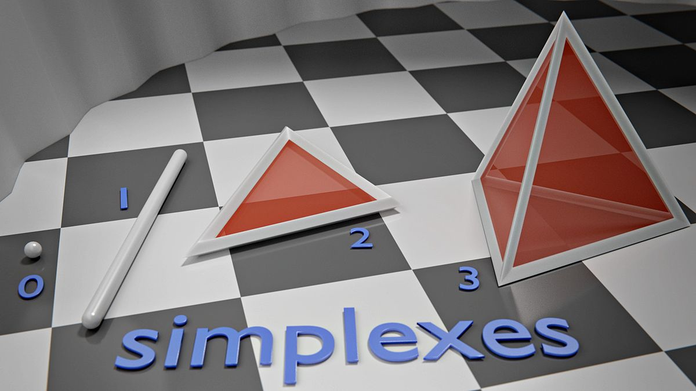
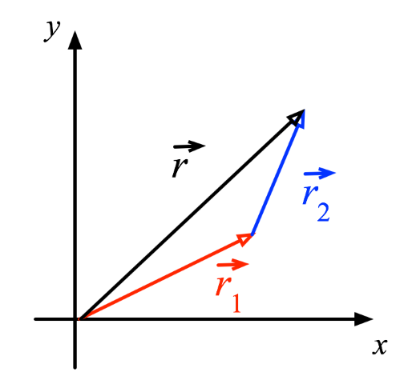
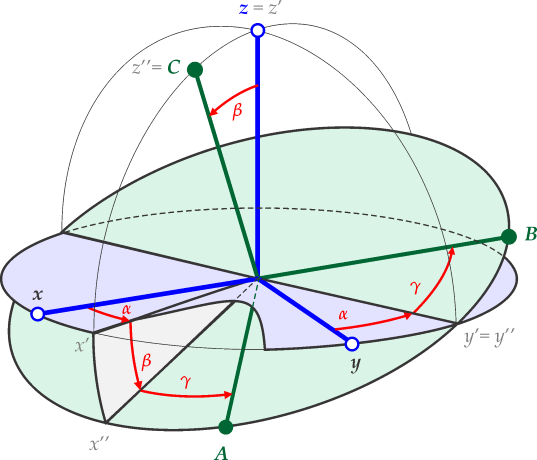

# crystal
[](https://opensource.org/licenses/MIT)

## Getting started 

The ``crystal`` package provides a simple and intuitive ``API`` 
for creating and manipulating high-dimensional simplexes.


I intend to use this as an initialization method for deep learning networks.

## Information
In geometry, a simplex (plural: simplexes or simplices) 
is a generalization of the notion of a triangle or tetrahedron to arbitrary dimensions.

* a 0-simplex is a point,
* a 1-simplex is a line segment,
* a 2-simplex is a triangle,
* a 3-simplex is a tetrahedron,
* a 4-simplex is a 5-cell.
* etc ...  



## N-dimensional simplex creation
Creates an N-dimensional isosceles simplex that has it's center at the origin 0.

1. First argument defines the number of dimensions.
2. Second argument defines the distance between the point

```python
import crystal

simplex = crystal.create_simplex_matrix(2, 1.)
simplex =
    [[0.14942925 - 0.55767754]
     [-0.55767754  0.14942925]
    [0.40824829
0.40824829]]

```

```python
import crystal

simplex = crystal.create_simplex_matrix(5, 1.)
simplex =
    [[0.5079504 - 0.19915638 - 0.19915638 - 0.19915638 - 0.19915638]
     [-0.19915638  0.5079504 - 0.19915638 - 0.19915638 - 0.19915638]
    [-0.19915638 - 0.19915638
0.5079504 - 0.19915638 - 0.19915638]
[-0.19915638 - 0.19915638 - 0.19915638  0.5079504 - 0.19915638]
[-0.19915638 - 0.19915638 - 0.19915638 - 0.19915638
0.5079504]
[0.28867513  0.28867513  0.28867513  0.28867513  0.28867513]]
```

## N-dimensional rotation matrix
Now we have created a set of N-dimensional points that define a simplex we may
need to manipulate them. 
To rotate them around the origin 0 we need a N-dimensional rotation matrix.
To create such a rotation matrix we call the function ```create_rotation_matrix```

1. Is a NxN matrix, each point i,j defined a rotation in radians around that axis pair
2. Second argument defines the cutoff in decimals and it is optional.

```python
import crystal
rotation_matrix = crystal.create_rotation_matrix(
        np.array([
            [0, np.pi/4, 0],
            [0, 0, np.pi/4],
            [0, 0, 0]]),
        cutoff_decimals=5)
rotation_matrix = \
    [[ 0.70711    -0.70711     0.        ]
     [ 0.50000455  0.50000455 -0.70711   ]
     [ 0.50000455  0.50000455  0.70711   ]]
```

## Simplex Class

The ``Simplex`` class encapsulates the simplex set of points and adds functionality
for offsetting and rotating. 

```python
import crystal
import numpy as np

distance=1.
input_dims = 100
output_dims = 101
simplex = crystal.Simplex(
        input_dims=input_dims,
        output_dims=output_dims,
        distance=distance)
offsets = np.random.normal(size=(1, input_dims))
rotations = np.random.normal(size=(input_dims, input_dims))
simplex.rotate(rotations).move(offsets)
```

### ```Simplex.move``` allows one to offset (move) the center of simplex.



###  ```Simplex.rotate``` allows one to rotate the simplex around the origin.



### Eigen-values auto-calibration
The ```Simplex``` class has the additional functionality of auto-calibrating
the distance between the points so that the maximum eigenvalue of the matrix is ~1.0
This is very important for stability if we wish 
to stack many of these objects.

#### Analysis

```python
import crystal
import numpy as np

input_dims = 100
output_dims = 101
simplex = crystal.Simplex(
        input_dims=input_dims,
        output_dims=output_dims)
m = simplex.matrix
m2 = np.matmul(m, np.transpose(m)) / input_dims
w = np.linalg.eigvals(m2)
max_eigenvalue = np.max(w)
max_eigenvalue = 1.
```