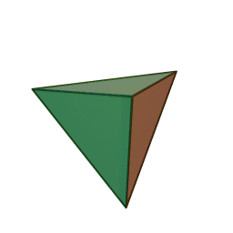
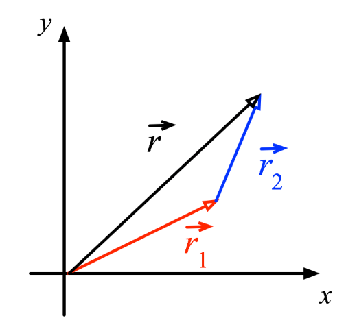
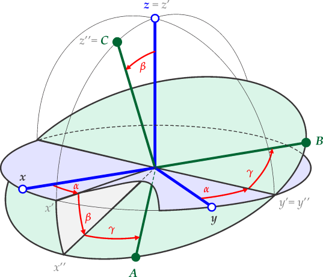

# crystal
[](https://opensource.org/licenses/MIT)

## Getting started

The `crystal` package provides a simple and intuitive API
for creating and manipulating high-dimensional simplexes.



I intend to use this as an initialization method for deep learning networks.

## Information
In geometry, a simplex (plural: simplexes or simplices)
is a generalization of the notion of a triangle or tetrahedron to arbitrary dimensions.

* a 0-simplex is a point,
* a 1-simplex is a line segment,
* a 2-simplex is a triangle,
* a 3-simplex is a tetrahedron,
* a 4-simplex is a 5-cell,
* etc.


## Mathematics and Geometry

A regular N-simplex has N+1 vertices, each equidistant from every other vertex.

* **Vertices:** N+1
* **Edges:** $\binom{N+1}{2}$
* **Edge length:** constant $d$ between every pair of vertices
* **Centroid angle:** the angle $\theta$ between any two vertex vectors, measured from the centroid, satisfies

$$\cos\theta = -\frac{1}{N}$$

so as N grows, vertex vectors become increasingly close to orthogonal.

* **Gram matrix:** for vertex matrix $M$ (rows are vertex coordinates), the Gram matrix $MM^T$ encodes all pairwise dot products. For a regular simplex centered at the origin, this matrix has a single large eigenvalue and N equal smaller eigenvalues, a structure that makes simplexes useful as maximally-separated, symmetric initializations.
* **Volume:** the N-dimensional volume of a regular N-simplex with edge length $d$ is

$$V = \frac{d^N}{N!}\sqrt{\frac{N+1}{2^N}}$$

## N-dimensional simplex creation
Creates an N-dimensional isosceles simplex centered at the origin 0.

1. First argument defines the number of dimensions.
2. Second argument defines the distance between the points.

```python
import crystal

simplex = crystal.create_simplex_matrix(2, 1.)
# simplex =
# [[ 0.14942925 -0.55767754]
#  [-0.55767754  0.14942925]
#  [ 0.40824829  0.40824829]]
```

```python
import crystal

simplex = crystal.create_simplex_matrix(5, 1.)
# simplex =
# [[ 0.5079504  -0.19915638 -0.19915638 -0.19915638 -0.19915638]
#  [-0.19915638  0.5079504  -0.19915638 -0.19915638 -0.19915638]
#  [-0.19915638 -0.19915638  0.5079504  -0.19915638 -0.19915638]
#  [-0.19915638 -0.19915638 -0.19915638  0.5079504  -0.19915638]
#  [-0.19915638 -0.19915638 -0.19915638 -0.19915638  0.5079504 ]
#  [ 0.28867513  0.28867513  0.28867513  0.28867513  0.28867513]]
```

## N-dimensional rotation matrix
Now that we have created a set of N-dimensional points defining a simplex,
we may need to manipulate them. To rotate them around the origin 0 we need
an N-dimensional rotation matrix. To create such a rotation matrix, call
`create_rotation_matrix`.

The implementation uses Givens rotations applied directly to matrix rows for
O(N³) complexity, making it efficient even for high-dimensional spaces
(tested up to 1000D).

1. An NxN matrix, where each point i,j defines a rotation in radians around that axis pair.
2. Second argument defines the cutoff in decimals and is optional.

```python
import crystal

rotation_matrix = crystal.create_rotation_matrix(
    np.array([
        [0, np.pi/4, 0],
        [0, 0, np.pi/4],
        [0, 0, 0]]),
    cutoff_decimals=5)
# rotation_matrix =
# [[ 0.70711    -0.70711     0.        ]
#  [ 0.50000455  0.50000455 -0.70711   ]
#  [ 0.50000455  0.50000455  0.70711   ]]
```

## Simplex Class

The `Simplex` class encapsulates the simplex set of points and adds functionality
for offsetting and rotating.

```python
import crystal
import numpy as np

distance = 1.
input_dims = 100
output_dims = 101
simplex = crystal.Simplex(
    input_dims=input_dims,
    output_dims=output_dims,
    distance=distance)
offsets = np.random.normal(size=(1, input_dims))
rotations = np.random.normal(size=(input_dims, input_dims))
simplex.rotate(rotations).move(offsets)
```

### `Simplex.move` allows one to offset (move) the center of the simplex.



### `Simplex.rotate` allows one to rotate the simplex around the origin.



### Eigenvalue Auto-Calibration

The `Simplex` class automatically calibrates the distance between points so that
the maximum eigenvalue of the scaled Gram matrix is approximately 1.0. This is critical
for numerical stability when stacking these structures in deep networks.

#### Mathematical Foundation

For a regular simplex with side length $d$ centered at the origin, the non-zero eigenvalues
of the scaled Gram matrix $\frac{1}{N}MM^T$ are approximately $\lambda \approx \frac{d^2}{2N}$.

To achieve $\lambda_{max} = 1$, the exact analytic solution is:

$$d = \sqrt{\frac{2N^2}{N+1}}$$

When `distance <= 0` is passed to the constructor, this formula is applied automatically.

#### Example

```python
import crystal
import numpy as np

input_dims = 100
output_dims = 101
simplex = crystal.Simplex(
    input_dims=input_dims,
    output_dims=output_dims,
    distance=-1)  # Auto-calibrate
m = simplex.matrix
m2 = np.matmul(m, np.transpose(m)) / input_dims
w = np.linalg.eigvals(m2)
max_eigenvalue = np.max(w)
# max_eigenvalue ≈ 1.0
```
