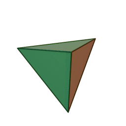

# crystal
[](https://opensource.org/licenses/MIT)

## Getting started 

The ``crystal`` package provides a simple and intuitive ``API`` 
for creating and manipulating high-dimensional simplexes.



I intend to use this as an initialization method for deep learning networks.

## Information
In geometry, a simplex (plural: simplexes or simplices) 
is a generalization of the notion of a triangle or tetrahedron to arbitrary dimensions.

* a 0-simplex is a point,
* a 1-simplex is a line segment,
* a 2-simplex is a triangle,
* a 3-simplex is a tetrahedron,
* a 4-simplex is a 5-cell.
* etc ...  


## N-dimensional simplex creation
Creates an N-dimensional isosceles simplex that has it's center at the origin 0.

1. First argument defines the number of dimensions.
2. Second argument defines the distance between the point 

```python
import crystal
simplex = crystal.create_simplex(2, 1.)
simplex = \
    [[ 0.14942925 -0.55767754]
     [-0.55767754  0.14942925]
     [ 0.40824829  0.40824829]]

```

```python
import crystal
simplex = crystal.create_simplex(5, 1.)
simplex = \
    [[ 0.5079504  -0.19915638 -0.19915638 -0.19915638 -0.19915638]
     [-0.19915638  0.5079504  -0.19915638 -0.19915638 -0.19915638]
     [-0.19915638 -0.19915638  0.5079504  -0.19915638 -0.19915638]
     [-0.19915638 -0.19915638 -0.19915638  0.5079504  -0.19915638]
     [-0.19915638 -0.19915638 -0.19915638 -0.19915638  0.5079504 ]
     [ 0.28867513  0.28867513  0.28867513  0.28867513  0.28867513]]
```

##  N-dimensional rotation matrix
Now we have created a set of N-dimensional points that define a simplex we may
need to manipulate them. 
To rotate them around the origin 0 we need a N-dimensional rotation matrix.
To create such a rotation matrix we call the function ```create_rotation_matrix```

1. Is a NxN matrix, each point i,j defined a rotation in radians around that axis pair
2. Second argument defines the cutoff in decimals and it is optional.

```python
import crystal
rotation_matrix = crystal.create_rotation_matrix(
        np.array([
            [0, np.pi/4, 0],
            [0, 0, np.pi/4],
            [0, 0, 0]]),
        cutoff_decimals=5)
rotation_matrix = \
    [[ 0.70711    -0.70711     0.        ]
     [ 0.50000455  0.50000455 -0.70711   ]
     [ 0.50000455  0.50000455  0.70711   ]]
```